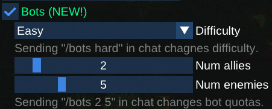

# Changelog

1. MAJOR version marks a significant milestone (e.g. bots, scripting).
2. MINOR version marks a network protocol-breaking change.
3. PATCH version marks a backward compatible feature or fix.

## [1.5.1] - 2025-08-010

### Changed

- Overhauled the main menu.
- Changed the font from `LiberationSans-Regular.ttf` to `Ubuntu-Regular.ttf`.

## [1.5.0] - 2025-08-09

### Added

- New weapon: Bilmik - the same as Bilmer 2000, just cheaper, without silencer, and with bigger recoil.

### Fixed

- Coins don't drop in Gun Game

## [1.4.0] - 2025-08-05

### Added

- Enemies now drop coins from exploded corpses! You have to physically touch them to collect your reward. Watch out though - you will drop the coins you collected if you die before the end of the round!
- Resurrected unused gun: Vindicator. An economy rifle ($2500) specific to Resistance. Has 35 bullets, so more than Galilea, but less damage than Baka47 (32 vs 40) and is as slow firing as Baka47. It is however way lighter and has almost non-existent recoil.

### Changed

- **Balance:** to account for the fact that you now have to walk to get the kill awards, all awards are now multiplied by 1.5, as well as dropping an additional $500 for a headshot.
- **Balance:** SMGs are more affordable now.
- **Balance:** Galilea: 34 -> 24 bullets, price: $2100 -> $2200

## [1.3.4] - 2025-07-25

### Fixed

- Fix broken ranked servers not letting in any clients.
	- Indirect cause: bots were just playing warmup in perpetuity, causing world state to bloat.
		- This is because when bots play, `is_idle()` is mistakenly reported `false`.
		- This caused the maps (and thus the current round) to never change once `when_idle_change_maps_once_every_mins`.
		- Maps now correctly cycle once every 15 minutes on ranked servers so this will never have a chance to happen again.
	- Direct cause: the world and game mode round state growing in perpetuity as bots continue to play the same "warmup" round indefinitely.
		- `cosmic::set_specific_name` wasn't cleared when a bot entity was deleted.
		- `knockouts` history (the list of kills) was growing indefinitely as it is only cleared on round restart.
		- `awards` history as well.
		- All of these are transmitted through the network on new connections - but the limit is only `2 MB`.

### Changed

- **Balance:** buff `pro90` headshot radius multiplier from `0.6` to `0.85`.

## [1.3.3] - 2025-07-20

### Added

- Webhooks also report servers hosted on the Web now (hypersomnia.io or CrazyGames).

### Fixed

- Deep netcode bug most evident when playing alone with bots on any map with fish/insects. Could happen with players as well.
	- Player was sometimes teleported, or getting randomly killed by bots even though it still walked on the screen. The footstep smokes were there but no bot was visible. What's happening?
		- This was because of the decorative organisms (e.g. fish on `de_cyberaqua`) mistakenly using the same RNG as the simulation logic.
		- Normally when state desyncs, it is detected by the client - a state hash that differs from the server's is seen and a resync from the server is requested.
		- Not this time - this bug was apparent on the predicted game world which only exists on the client.
		- When the client is alone on the server, their predicted game world is usually spot on and might never get corrected for a long time until a random spike in lag (latency affects which simulation step your inputs might get applied to, so the **more stable your connection was, the more often this happened** as the predicted world was corrected more rarely).
		- However if that predicted game world has a different advance logic, the predicted and the referential server world might start diverging exponentially.
		- This is what happened here - within the predicted world, I purposely disable simulating fish to save processing time, assuming that will not break determinism of the rest of the simulation, but I haven't realized the fish are using the same RNG as the logic. Fish requesting next random values from the RNG causes the next requests to be different for the other simulation logic later down the road.

## [1.3.2] - 2025-07-11

### Fixed

- Windows builds weren't properly tagged.

## [1.3.1] - 2025-07-10

### Added

- "Bots" checkmark in `Host server` window.

  

### Fixed

Most bugs were introduced by bots in `1.3.0`:

- **Netcode:** new connections reinferred the world at 1 step too late, this shift causing resyncs in the beginning.
- Don't show servers with bots as full in server browser.
- Player didn't immediately spawn in place of a bot when joining for the first time.
- Prevent _Game commencing_ when someone joins the opposite team that already has bots.
- Broken music clock after `1.3.0`.

## [1.3.0] - 2025-07-09

### Added

- **Basic bots.**
	- `/bots [x] [y]` command. `/bots 4` sets total quota, `/bots 1 4` specifies a custom split. `/bots` resets to default.
	- `/bots e|m|h` sets bot difficulty to either easy, medium or hard.
	- Taking control of the bot upon player death.
	- Reporting number of online bots/humans in the server list.
	- Bots are still not perfect - they can't plant/defuse bombs etc, don't have pathfinding - they only walk randomly and shoot at the player, chasing him as well.
- Clients can set their *Clan* in addition to their Nickname (`Settings -> Client`).
	- The *Clan* will appear in the scoreboard (Tab).
- `server_private.custom_webhook_urls` - Matrix-friendly webhooks.
	- Can have multiple targets that filter by *Clan*.
	- A single server keep multiple communities up-to-date with events only relevant to them.
	- E.g. if a player from a given _Clan_ connects to the server, only their _Clan_ will be notified.
	- This also relays chat messages now.

### Changed

- Can always use `/map` if all players are on the same team (so e.g. **if alone** on the server).
- Improved config scheme:
	- Renamed `config.json` to `runtime_prefs.json` to avoid ambiguity.
	- `runtime_prefs.json` now **takes precedence** over `conf.d/`.
		- This means that RCON changes **are now persistent** between server restarts.
	- RCON window now shows the content of `runtime_prefs.json` and you can reset all the RCON-made changes with a button click.

### Fixed

- **Balance:** `ao44` and `covert` prices have been swapped.
- (Likely) NixOS crash in the server browser.
- Broken clipboard in Linux Steam builds.
- FFA/gun game match results now report correctly through the webhooks.
- `user/conf.d` will only consider `.json` files from now to prevent crash when a non-json file is accidentally put there.
- `[Web]` was incorrectly added to the native client's nickname when connecting to a server hosted in the browser.

### Notes

- This is the first tagged version. Previous work existed but wasn't versioned.
