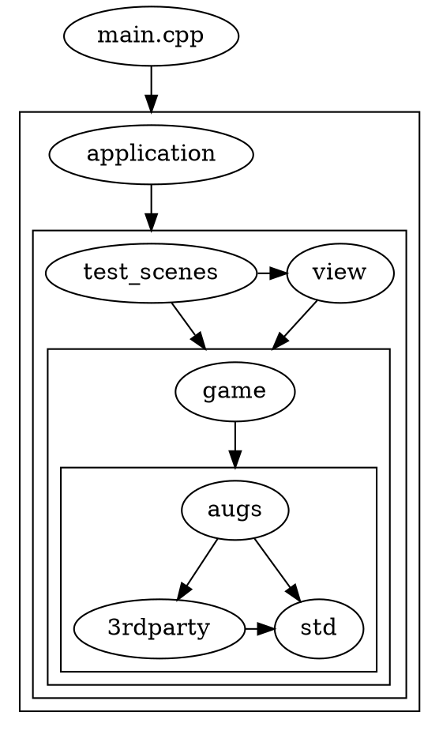

## Repository structure

- ```cmake/``` - CMake scripts and source code generators. ([Introspector-generator](https://github.com/TeamHypersomnia/Introspector-generator), version_file_generator)
- ```docs/``` - source code of this website.
- ```hypersomnia/``` -  target working directory of the executable. All content needed by Hypersomnia to run properly is present here: images, sounds, shaders, configs and so on. 
- ```src/``` - C++ only source code of Hypersomnia, along with 3rd party libraries, some of which are written in C.
  - ```src/3rdparty/``` - 3rd party libraries, upon which the rest of ```src/``` depends.
  - ```src/augs/``` - abstraction of i/o; template code, utility functions, window management.
  - ```src/game/``` - Hypersomnia-specific code that implements the game world. Strictly, just the **model** is present here.
  - ```src/view/``` - Code that is concerned with viewing the game world. Examples: viewables (meant for viewing only, as opposed to logical assets used by the model), state of particle systems, interpolation, playing of sounds, or rendering scripts that take the game world reference and speak directly to OpenGL.
  - ```src/test_scenes/``` - Code generating some simple test scenes, with their needed resources. It exists only in order to conveniently test new game features without relying on the editor. Can be excluded from compilation via BUILD_TEST_SCENES CMake flag.
  - ```src/application/``` - highest level abstraction. Examples: _setups_ implementation, the main menu or the ingame menu overlay, workspace file format, but also collateral things like http server code.
    - ```src/application/setups``` - _setups_ are objects that manage high-level functionality like a client, a server, an editor or a local test scene. They expose functions like ```get_viewed_cosmos()``` or ```get_viewed_character_id()``` that are in turn used by  [```main.cpp```](main) to know what world to render and with which [entity](entity) as the viewer.
  - [```main.cpp```](main) - that, which straps all of the above together. Initializes libraries, contextes, necessary resources, handles input, selects the setup to work with, keeps track of the single ```audiovisual_state```.

### Dependency graph of ```src/```

An arrow from node A to node B denotes that A includes files from B. An arrow to a cluster means that the node may include from all nodes in the cluster.

![enter image description here][2]

  [2]: https://i.imgur.com/SzYA3BA.png

#### Source (DOT language)


#### Exceptions

- Modified Box2D files (from ```src/3rdparty```) include ```src/game/transcendental/entity_id.h``` in order to conveniently define a userdata type that contains the id of the entity to whom a ```b2Fixture``` or a ```b2Body``` belongs. Separating that dependency would otherwise involve a lot of alterations to Box2D in terms of code templatization, or unsafe reinterpret casts between ```void*``` and ```entity_id``` types. 

## Core principles

### On extensibility 

Much of the codebase described here could be readily applied to just about any kind of game.  
You might find some topics like [entities](entity), [components](component) or [systems](stateless_system) defined in a rather general fashion, 
not necessarily pertaining to any particular Hypersomnia mechanic, or even to any specific game genre.  

It should be remembered though, that the main focus of this project **is not to create a universal game engine**,  
but to create a [fun](https://en.wiktionary.org/wiki/fun#Adjective), fast-paced top-down game,
customization of which will be possible almost exclusively by direct interaction with the game's C++ source code.
That is why, on one hand, you may find ```augs/``` to be a game-agnostic "framework", but on the other hand, you will find:
- hardcoded C++ enumerations of [render layers](render_layer) with well-defined roles;
- a very game-specific, natively coded [rendering routine](illuminated_rendering) in C++ that uses these render layers and speaks directly to OpenGL without any kind of general rendering framework;
- little to none script support (except configuration files, e.g. [``config.lua``](config_lua)), at least not until there is such a demand in the community.

To reach out to the non-tech-savvy audience, a full-flegded [editor](editor) is developed. 

In particular, **no scripted plugin system** is planned to ever come about.
We believe that the C++ codebase may be made so easily extendable that any fan of Hypersomnia, that is coincidentally a programming adept,
could easily add their modifications, that would in turn be reviewed by the community in order to be finally merged into the official game.

This is because:
- C++ code is way, way more easier to reason about (and thus maintain) than some obscure plugin code written in a dynamically-typed script.
- C++ is more performant than any scripting language.
- Possible conflicts between community extensions might be resolved at the compilation stage, and thus very early.

### Using external code

Although a great part of the game is hand-written, this project **is not, in fact, about writing a game from scratch**.

You can notice that there is [plenty of third-party code](https://github.com/TeamHypersomnia/Hypersomnia/tree/master/src/3rdparty) used in Hypersomnia.
At that point, you might ask, why not choose a standalone game framework that has all of this functionality built-in?  

We believe it is beneficial to manually pick the libraries that the game is proven to need at this exact moment:

- If there is no particular reason to use other audio formats than ``wav`` or ``ogg`` in the game, why also waste time compiling some other obscure formats?
- Game frameworks might not always be up-to-date with latest improvements to specific libraries, like ``OpenAL Soft`` or ``enet``.
- You are in complete control of what to build, and what to not build. It is useful if you want to iterate faster - then you can, for example, [completely exclude networking or sound from the game](cmakelists#build-settings), resulting in faster builds.
- You can learn something new! After all, you're not writing it from scratch, you're just putting a little more time to assemble your perfect toolset!

Generally, if writing gameplay code, you should not need to introduce any other external library at this point, maybe to the exception of some crazy math.
It is however entirely possible that such a need arises. In this case:
- Make sure that the library is compatible with [AGPL-3.0](https://github.com/TeamHypersomnia/Hypersomnia/blob/master/LICENSE.md).
- Make sure that there is no library that too suits your need while having less dependencies.

## Coding conventions

Please notice that some of the following conventions are not necessarily what would have been decided had the project begun yesterday.
These have been established too long ago, when the project wasn't thought of quite seriously, and the codebase has grown too huge for the style to be changed now.

The rules are:

- Usage of modern C++ features is highly recommended, but make sure that they are supported by:
    - The latest stable GCC release (at the time of this writing, 7.2).
    - MSVC that ships with the latest Visual Studio Preview.

    Worry not though, if you mess up with either, we will know thanks to AppVeyor and TravisCI integration.

- Use tabs for indentation.
- Use uncapitalized ```underscore_case``` everywhere.
    - But do literally what you want with template parameters.
- [Linux kernel indentation style](https://en.wikipedia.org/wiki/Indentation_style#K.26R).
    - But ALWAYS use brackets after ``if``/``else``/``for`` and the like! Too much life has been wasted on the illusion that this line is really a single expression...
    - Example:

            if constexpr(std::is_same_v<T, int>) {
            	// ...
            }
            else {
            	// ...
            }
        
- Put a single space after ``if``, ``while``, ``for``, etc. Like so:
    - ```if (expression)``` 
    - ```if constexpr(expression)```
    - ```do { ... } while (expression);```
- Prefer initialization with ``auto`` or ``const auto``.
    - Except if you need [default initialization](http://en.cppreference.com/w/cpp/language/default_initialization) or non-movable types as move elision does not yet fully work in MSVC.
- Put a single space between the operator and each operand, e.g. ``const auto abc = 2 + 2;``
- Put ```const``` wherever possible even at the cost of readability. 
    - In particular, ```const``` every possible function argument.
    - But don't ```const``` in the function declarations, though this must still be corrected for much of the existing code.
- There isn't really a fixed maximum for the line's length, but keep it around 125 characters. If you must break the function arguments, do it like so:

        
        function(
        	a,
        	b
        	c
        );
        
        func(other_func(hey_there(
        	a,
        	[](){
        		return 1337;
        	},
        	c
        )));

        void something::foo(
			const int bar,
			const double other
		) const {

		}
        

- The rest is left to your imagination.

Additionally, all modifications to the code not original to the Hypersomnia repository (third party libraries or just any submodule) shall stay in accordance with their respective conventions.


