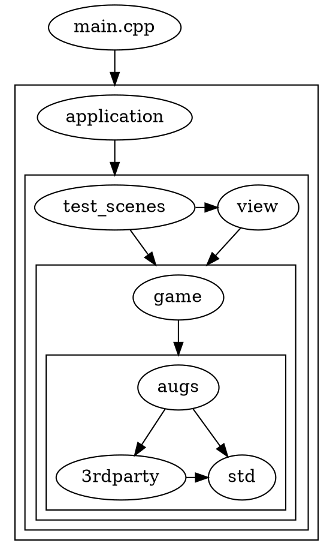

## Repository structure

- ```cmake/``` - CMake scripts and source code generators. ([Introspector-generator](https://github.com/TeamHypersomnia/Introspector-generator), version_file_generator)
- ```docs/``` - source code of this website.
- ```hypersomnia/``` -  target working directory of the executable. All content needed by Hypersomnia to run properly is present here: images, sounds, shaders, configs and so on. 
- ```src/``` - C++ only source code of Hypersomnia, along with 3rd party libraries, some of which are written in C.
  - ```src/3rdparty/``` - 3rd party libraries, upon which the rest of ```src/``` depends.
  - ```src/augs/``` - abstraction of i/o; template code, utility functions, window management.
  - ```src/game/``` - Hypersomnia-specific code that implements the game world. Strictly, just the **model** is present here.
  - ```src/view/``` - Code that is concerned with viewing the game world. Examples: viewables (meant for viewing only, as opposed to logical assets used by the model), state of particle systems, interpolation, playing of sounds, or rendering scripts that take the game world reference and speak directly to OpenGL.
  - ```src/test_scenes/``` - Code generating some simple test scenes, with their needed resources. It exists only in order to conveniently test new game features without relying on the editor. Can be excluded from compilation via BUILD_TEST_SCENES CMake flag.
  - ```src/application/``` - highest level abstraction. Examples: _setups_ implementation, the main menu or the ingame menu overlay, workspace file format, but also collateral things like http server code.
    - ```src/application/setups``` - _setups_ are objects that manage high-level functionality like a client, a server, an editor or a local test scene. They expose functions like ```get_viewed_cosmos()``` or ```get_viewed_character_id()``` that are in turn used by main.cpp to know what world to render and with which entity as the viewer.
  - ```main.cpp``` - that, which straps all of the above together. Initializes libraries, contextes, necessary resources, handles input, selects the setup to work with, keeps track of the single ```audiovisual_state```.

### Dependency graph of ```src/```

An arrow from node A to node B denotes that A includes files from B. An arrow to a cluster means that the node may include from all nodes in the cluster.

![enter image description here][2]

  [2]: https://i.imgur.com/SzYA3BA.png

#### Source (DOT language)


#### Exceptions

- Modified Box2D files (from ```src/3rdparty```) include ```src/game/transcendental/entity_id.h``` in order to conveniently define a userdata type that contains the id of the entity to whom a ```b2Fixture``` or a ```b2Body``` belongs. Separating that dependency would otherwise involve a lot of alterations to Box2D in terms of code templatization, or unsafe reinterpret casts between ```void*``` and ```entity_id``` types. 

## Core principles

Many concepts described here could be readily applied to just about any kind of game.  
That said, the main focus of this project **is not to create a general game engine**,  
but to create a [fun](https://en.wiktionary.org/wiki/fun#Adjective), fast-paced top-down game,  
customization of which will mostly be possible to C++ programmers only.  
That is why, on one hand, you may find ```augs/``` to be a game-agnostic "framework", but on the other hand, you will find:
- hardcoded enumerations of [render layers](render_layer) with well-defined behaviours;
- natively coded [rendering routine](illuminated_rendering) in C++ that uses these layers and speaks directly to OpenGL without any kind of intermediary framework;
- little to none scripting support, at least not until there is such a demand in the community.

To reach out to the non-tech-savvy audience, a full-flegded [editor](editor) is developed. 

## Coding conventions

Hypersomnia codebase uses ```underscore_case``` everywhere.
If a function call 
